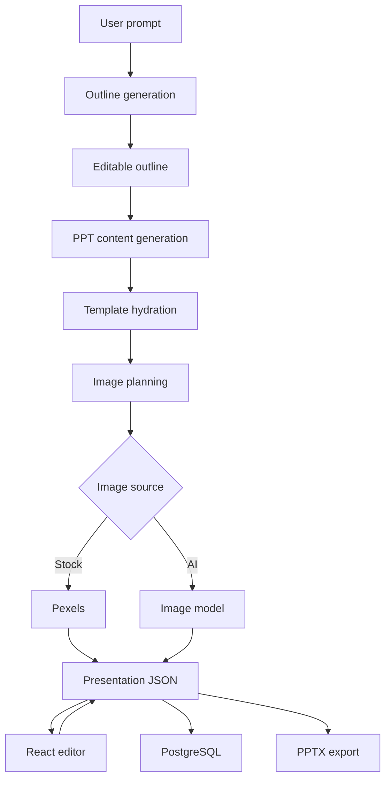

<p align="right"><strong>English</strong> | <a href="./README.md">简体中文</a></p>

# PPT Agent · AI Presentation Generator & Editor

An AI-powered presentation generation and editing application built around a structured **Presentation JSON** workflow. A user prompt becomes an editable outline, template slots are hydrated, images are planned and fulfilled, the result is edited in React, persisted as a project, and exported to PPTX from the same source of truth.

## Highlights

- End-to-end flow: **Prompt → Outline → Presentation JSON → Template Hydration → Image Planning → React Editor → PPTX Export**
- Structured generation instead of arbitrary HTML / SVG / PPT code
- FastAPI + Pydantic validation for model output
- React + Zustand editor with manual editing and project state management
- Supabase Auth + PostgreSQL + SQLAlchemy + Alembic persistence
- Stock image search and AI image generation with fallback paths
- Mock demo mode for product demos without consuming model tokens

## Architecture

Presentation JSON is the single source of truth.



## Tech Stack

- **Frontend**: React, TypeScript, Zustand, TanStack Query
- **Backend**: Python, FastAPI, Pydantic
- **Database**: PostgreSQL, SQLAlchemy, Alembic
- **Auth**: Supabase Auth
- **AI**: OpenAI-compatible LLM / image APIs
- **Images**: Pexels + AI image generation

## Project Structure

```text
backend/
  app/api/routes/
  app/services/
  app/ai/
  app/template_engine/
  app/images/
  app/templates/
frontend/
  src/pages/
  src/components/
  src/stores/
  src/lib/
  src/types/
```

## Setup

### Backend

```bash
cd backend
python -m venv .venv
.venv\Scripts\Activate.ps1
pip install -r requirements.txt
copy .env.example .env
alembic upgrade head
uvicorn main:app --reload
```

### Frontend

```bash
cd frontend
npm install
copy .env.example .env.local
npm run dev
```

## Reliability Design

- AI output must be parsed into Presentation JSON before entering the editor
- Pydantic validates structure before state is accepted
- Image generation and stock search have fallback paths
- Generation quota is reserved before execution and refunded on failure
- Recent-project caching and prefetching reduce repeated requests
- Mock mode supports token-free product demos

## Testing

```bash
cd frontend
npm run lint
npm run build

cd ../backend
pytest
```

Typical end-to-end flow:

```text
login → generate outline → generate PPT → edit slide → auto save → refresh → reopen → export PPTX
```

---

This project explores a practical question: **how can unreliable generative AI output be constrained into a real product workflow that is editable, persistent, and exportable?**
