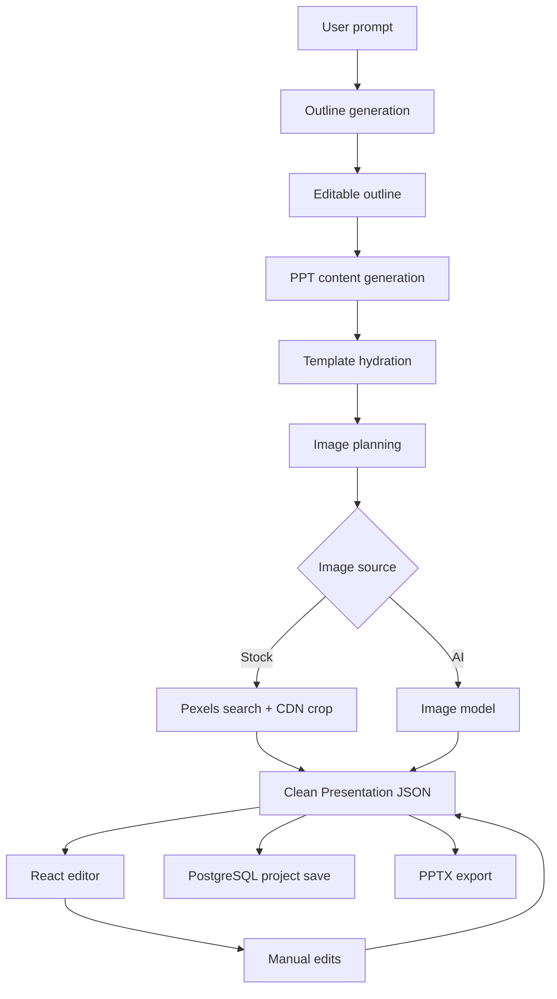

# PPT Agent

AI-powered PPT editor and generator. The app turns a user prompt into structured Presentation JSON, renders it in a React editor, supports manual edits, saves projects, and exports PPTX from the same source of truth.

## Current Status

- Main loop is working: outline -> PPT JSON -> template hydration -> image planning -> image fulfillment -> React preview -> PPTX export.
- Persistence is implemented with Supabase Auth, PostgreSQL, SQLAlchemy, and Alembic.
- Project history, cached recent projects, quota display, delete confirmation, and a mock demo path are available.
- `jamesel398@gmail.com` is treated as a demo account with unlimited generation quota and a mock mode button in the sidebar user menu.

## Architecture

Presentation JSON is the single source of truth. AI does not generate final HTML, PPTX, SVG, or arbitrary page code as primary product data.



Backend layout:

```text
backend/main.py
backend/app/api/routes/        FastAPI routes
backend/app/services/          generation and project orchestration
backend/app/ai/                LLM client, prompts, response parsing
backend/app/template_engine/   template loading and hydration
backend/app/images/            image planning, providers, helpers
backend/app/templates/         curated template JSON
backend/app/schemas.py         request/response and Presentation JSON models
```

Frontend layout:

```text
frontend/src/pages/            app pages
frontend/src/components/       editor and shell components
frontend/src/stores/           Zustand state
frontend/src/lib/              API cache, errors, Supabase client
frontend/src/types/            Presentation JSON TypeScript types
```

## Setup

Backend:

```bash
cd backend
python -m venv .venv
.venv\Scripts\Activate.ps1
pip install -r requirements.txt
copy .env.example .env
alembic upgrade head
uvicorn main:app --reload
```

Frontend:

```bash
cd frontend
npm install
copy .env.example .env.local
npm run dev
```

## Environment Variables

Backend variables live in `backend/.env`. Frontend variables live in `frontend/.env.local`.

Required for a real run:

- `API_KEY`, `BASE_URL`, `MODEL_PRO`, `MODEL_FLASH`
- `MODEL_PHOTO` if AI image generation is used
- `PEXELS_KEY` if stock image fulfillment is used
- `DATABASE_URL`, `ASYNC_DATABASE_URL`
- `SUPABASE_URL`
- `VITE_SUPABASE_URL`, `VITE_SUPABASE_PUBLISHABLE_KEY`

Use `.env.example` files as templates. Do not commit `.env` or `.env.local`.

## Testing

Frontend:

```bash
cd frontend
npm run lint
npm run build
```

Backend:

```bash
cd backend
.venv\Scripts\Activate.ps1
pytest
```

Integration smoke test:

```text
login -> generate outline -> generate PPT -> edit slide -> auto save -> refresh -> open recent project -> export PPTX
```

## Stability Notes

The app reduces generation failures through structured prompts, Pydantic schema validation, controlled template slots, image fallback, and clean Presentation JSON normalization.

Important constraints:

- AI output must be parsed into Presentation JSON before entering the editor.
- Raw AI output and image planning logs may be printed in development, but are not stored in Presentation JSON.
- Stock images use orientation filtering plus provider-side crop parameters to avoid deformation.
- AI image generation can fall back to stock search, and stock search can fall back to AI generation before placeholder fallback.
- Generation quota is pre-reserved atomically and refunded if PPT generation fails.

No AI workflow can fully eliminate malformed model output. The current strategy is to fail clearly, preserve saved projects, and make retry/demo paths simple.

## Performance And Token Plan

Low-risk improvements already used:

- Recent projects are cached with TanStack Query.
- Project detail is prefetched on sidebar hover.
- Generated and recently edited projects are moved to the top of the sidebar immediately.
- The frontend can run a mock chain for demos without spending tokens.

Recommended next optimizations:

- Send compact template manifests to the model instead of full template JSON.
- Generate only slot values, not repeated layout metadata.
- Cache static template summaries on the backend.
- Keep stock image search first for generic photo needs, and use AI images only when the prompt requires specific synthetic visuals.
- Add stage timing logs before introducing a real async progress queue.
- Parallelize independent image fulfillment with bounded concurrency if provider limits allow.

## Deployment Checklist

- `frontend/.env.local` and `backend/.env` are configured.
- Frontend production build sets `VITE_API_BASE_URL` to the deployed backend origin before running `npm run build`.
- `alembic upgrade head` has run against the target database.
- `DEBUG_RAW_AI_RESPONSE=false` in production.
- CORS includes the deployed frontend origin.
- Supabase Auth email/password is enabled.
- The backend process starts from the `backend/` directory, or its environment variables are injected by the process manager.
- `/health` returns `{"status":"ok"}` through the deployed backend domain.
- `npm run lint`, `npm run build`, and backend `pytest` pass.
- A full authenticated generation smoke test succeeds.

Example deployment snippets live in:

- `deploy/systemd/pptagent-backend.service.example`
- `deploy/nginx/pptagent.conf.example`

Typical production commands:

```bash
cd frontend
npm ci
VITE_API_BASE_URL=https://your-api-domain.com npm run build

cd ../backend
python -m venv .venv
. .venv/bin/activate
pip install -r requirements.txt
alembic upgrade head
uvicorn main:app --host 127.0.0.1 --port 8000
```

