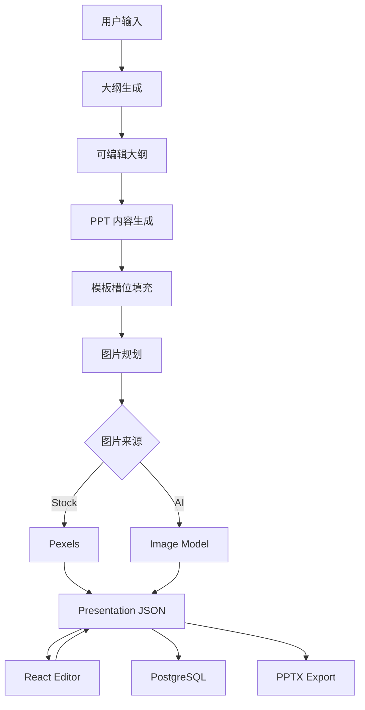

# PPT Agent · AI 演示文稿生成与编辑

一个围绕 **Presentation JSON** 构建的 AI PPT 生成与编辑应用。用户输入主题后，系统依次完成大纲生成、模板槽位填充、图片规划、React 编辑预览、项目持久化，并最终从同一份结构化数据导出 PPTX。

## 核心亮点

- 完整链路：**Prompt → Outline → Presentation JSON → Template Hydration → Image Planning → React Editor → PPTX Export**
- AI 不直接生成任意 HTML / SVG / PPTX，而是先产出受约束的结构化数据
- FastAPI + Pydantic 对模型输出做结构校验
- React + Zustand 编辑器支持手动修改与项目状态管理
- Supabase Auth + PostgreSQL + SQLAlchemy + Alembic 完成用户与项目持久化
- Pexels 图片搜索与 AI 图片生成支持互相回退
- Mock Demo 模式可在不消耗模型 Token 的情况下演示完整流程

## 架构

Presentation JSON 是整个系统的 single source of truth。


```mermaid
flowchart TD
  A["用户输入"] --> B["大纲生成"]
  B --> C["可编辑大纲"]
  C --> D["PPT 内容生成"]
  D --> E["模板槽位填充"]
  E --> F["图片规划"]
  F --> G{"图片来源"}
  G -->|Stock| H["Pexels"]
  G -->|AI| I["Image Model"]
  H --> J["Presentation JSON"]
  I --> J
  J --> K["React Editor"]
  K --> J
  J --> L["PostgreSQL"]
  J --> M["PPTX Export"]
```

## 技术栈

- **Frontend**: React, TypeScript, Zustand, TanStack Query
- **Backend**: Python, FastAPI, Pydantic
- **Database**: PostgreSQL, SQLAlchemy, Alembic
- **Auth**: Supabase Auth
- **AI**: OpenAI-compatible LLM / image APIs
- **Images**: Pexels + AI image generation

## 目录结构

```text
backend/
  app/api/routes/
  app/services/
  app/ai/
  app/template_engine/
  app/images/
  app/templates/
frontend/
  src/pages/
  src/components/
  src/stores/
  src/lib/
  src/types/
```

## 本地运行

### Backend

```bash
cd backend
python -m venv .venv
.venv\Scripts\Activate.ps1
pip install -r requirements.txt
copy .env.example .env
alembic upgrade head
uvicorn main:app --reload
```

### Frontend

```bash
cd frontend
npm install
copy .env.example .env.local
npm run dev
```

## 稳定性设计

- 模型输出必须先解析为 Presentation JSON 才能进入编辑器
- Pydantic 校验结构，避免非法数据污染编辑态
- 图片生成与图库搜索均有 fallback
- 生成额度预扣，生成失败时退款
- 最近项目缓存与预取减少重复请求
- Mock chain 支持无 Token 演示

## 测试

```bash
cd frontend
npm run lint
npm run build

cd ../backend
pytest
```

典型端到端流程：

```text
login → generate outline → generate PPT → edit slide → auto save → refresh → reopen → export PPTX
```

---

这个项目主要探索：**怎样把不稳定的生成式 AI 输出约束成一个可编辑、可持久化、可导出的真实产品工作流。**
